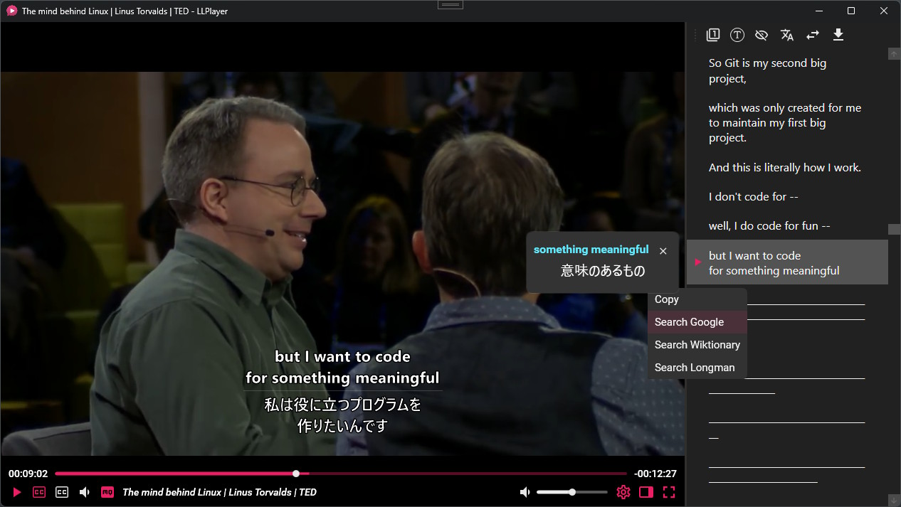

# LLPlayer — AI-Powered Video Player with Real-Time Subtitle Generation

> An intelligent Windows desktop video player that generates, translates, and interacts with subtitles in real time using local AI models — no cloud required.



---

## Table of Contents

- [Why This Project?](#why-this-project)
- [Key Features](#key-features)
- [Architecture Overview](#architecture-overview)
- [Tech Stack](#tech-stack)
- [Project Structure](#project-structure)
- [System Requirements](#system-requirements)
- [Getting Started](#getting-started)
- [Configuration](#configuration)
- [Plugin System](#plugin-system)
- [Keyboard Shortcuts](#keyboard-shortcuts)
- [Contributing](#contributing)
- [License](#license)

---

## Why This Project?

Traditional media players stop at playback. LLPlayer goes further by understanding video content in real time:

- **Automatic Speech Recognition (ASR):** Transcribes audio to text on-the-fly using Whisper models running locally on your machine.
- **Context-Aware LLM Translation:** Translates subtitle lines using a large language model that retains context across the scene — not just word-for-word.
- **OCR-Based Subtitle Extraction:** Reads hardcoded (burned-in) subtitles directly from video frames, making even non-subtitled anime or foreign content accessible.
- **Word-Level Lookup:** Click any subtitle word for instant dictionary lookup, Google search, Wiktionary, or Longman — without leaving the player.

The primary audience is **language learners** practicing immersive input (e.g. watching native Japanese or Chinese content), but it works as a general-purpose intelligent media player for anyone who wants AI-enhanced video understanding.

---

## Key Features

### Intelligent Subtitles

| Feature | Description |
|---|---|
| **Real-Time ASR** | Generates subtitles live from any audio source using on-device Whisper models |
| **Dual Subtitle Display** | Show two subtitle tracks simultaneously (e.g. Japanese original + English translation) |
| **Context-Aware Translation** | LLM retains scene context across lines for natural, coherent translations |
| **Subtitle Seeking** | Click any line in the sidebar transcript to jump to that moment in the video |
| **Subtitle Sidebar** | Scrollable panel showing the full generated transcript for search and review |
| **Subtitle Export** | Export generated subtitles to standard formats |

### AI & Language Capabilities

| Feature | Description |
|---|---|
| **Multiple Whisper Backends** | CPU, CUDA (NVIDIA), and Vulkan acceleration — swap without reinstalling |
| **Hybrid Translation** | Use local LLMs for privacy or cloud APIs (DeepL, DeepLX) for speed |
| **Word Lookup Popup** | Right-click any word: Copy / Search Google / Wiktionary / Longman |
| **OCR on Video Frames** | Extracts text from image-based subtitles using optical character recognition |

### Playback & Streaming

| Feature | Description |
|---|---|
| **URL Streaming** | Paste a URL to stream and analyze online video in real time |
| **Format Support** | Powered by FFmpeg — plays virtually any video/audio format |
| **Seek & Frame Control** | Accurate frame-level seeking with forward/backward controls |
| **Audio Device Switching** | Switch audio output devices without restarting |

### UI & Customization

| Feature | Description |
|---|---|
| **Dark-Themed Interface** | Focused, distraction-free dark UI built with Material Design |
| **Custom Keyboard Shortcuts** | Fully rebindable key bindings via the cheat sheet dialog |
| **Font & Color Picker** | WpfColorFontDialog for subtitle font, size, color, and outline customization |
| **Pan, Zoom & Ratio** | Interactive pan/zoom and aspect ratio controls on the video surface |
| **Drag & Drop** | Drop any file or URL directly onto the player to open it |

---

## Architecture Overview

LLPlayer is built around a deliberate two-layer architecture that keeps the AI/media engine completely decoupled from the WPF UI.

```
+-----------------------------------------------------+
|                 LLPlayer (WPF App)                  |
|   AppStartup · MVVM · Config · Dialogs · Plugins    |
+--------------------+--------------------------------+
                     |  IHostPlayer  (interface seam)
+--------------------v--------------------------------+
|              FlyleafHost (WPF Control)              |
|   Win32 Surface + WPF Overlay synchronization       |
|   Owns: mouse/keyboard input · fullscreen · DPI     |
+--------------------+--------------------------------+
                     |
+--------------------v--------------------------------+
|               FlyleafLib (Media Engine)             |
|                                                     |
|  Demuxer --> DecoderContext --> AudioDecoder        |
|                            --> VideoDecoder         |
|                            --> SubtitlesDecoder     |
|                                     |               |
|                            --> Subtitles (ASR/OCR)  |
|                            --> TranslateService      |
+-----------------------------------------------------+
```

### Key Design Decisions

**`FlyleafHost` as the architectural seam**

The WPF rendering surface is a raw Win32 HWND (required for DirectX video rendering), while the subtitle/overlay UI is a standard WPF window. `FlyleafHost` owns both and keeps them pixel-perfectly synchronized through every DPI change, window move, and fullscreen toggle. The media engine (`FlyleafLib`) never imports WPF — it only calls back through the `IHostPlayer` interface. This is the most connected class in the codebase by design: it is the only permitted bridge between the two layers.

**`DecoderContext` as the pipeline coordinator**

`DecoderContext` manages the lifecycle of all decoder types (audio, video, subtitles, data) and coordinates with `Demuxer` for stream selection and seeking. It exposes plugin hooks (`ISuggestAudioStream`, `ISuggestBestExternalSubtitles`, `ISuggestPlaylistItem`) so plugins can influence decisions without touching the core.

**`ITranslateService` / `IPlugin` as extension points**

All AI backends (Whisper engines, translation providers) implement a clean interface. Swap or extend them without modifying the player core. A new translation backend is a single class implementing `ITranslateService`.

**`Config` as the single source of truth**

All settings (player, audio, subtitles, translation, theme) live in a serializable `Config` hierarchy. Every sub-config supports `Clone()`, `Load()`, `Save()`, and `SetPlayer()`. Settings persist across sessions and can be exported/imported.

---

## Tech Stack

| Layer | Technology |
|---|---|
| **UI Framework** | WPF (.NET 9), Material Design in XAML |
| **Media Engine** | FlyleafLib (FFmpeg bindings via P/Invoke / NativeMethods) |
| **Speech-to-Text** | Whisper (CPU / CUDA / Vulkan via faster-whisper) |
| **Translation** | Local LLMs, DeepL API, DeepLX |
| **OCR** | On-device OCR for burned-in subtitle extraction |
| **Architecture** | MVVM, ICommand (RelayCommand), Dependency Injection (Prism) |
| **Rendering** | DirectX via Win32 HWND surface + WPF overlay |
| **Plugin System** | Custom `IPlugin` / `PluginBase` extensibility layer |
| **Serialization** | System.Text.Json with custom converters (ColorHexJsonConverter) |
| **Language** | C# 12 / .NET 9 |

---

## Project Structure

```
/
├── FlyleafLib/                      # Core media engine (zero WPF dependency)
│   ├── Engine/                      # Engine init, FFmpeg, audio/video subsystems
│   ├── MediaPlayer/                 # Player, Demuxer, DecoderContext
│   │   ├── Player.cs                # Main player class
│   │   ├── Demuxer.cs               # Stream demuxing and seeking
│   │   └── DecoderContext.cs        # Decoder lifecycle coordinator
│   ├── MediaFramework/
│   │   ├── MediaDecoder/            # AudioDecoder, VideoDecoder, SubtitlesDecoder
│   │   ├── MediaStream/             # AudioStream, VideoStream, SubtitlesStream
│   │   └── MediaFrame/              # AudioFrame, VideoFrame, SubtitlesFrame
│   ├── Controls/
│   │   └── WPF/FlyleafHost.cs       # Win32 <-> WPF bridge (architectural seam)
│   └── Plugins/                     # IPlugin, PluginBase, plugin interfaces
│
├── LLPlayer/                        # WPF application layer
│   ├── App.xaml.cs                  # Startup, DI registration, error handling
│   ├── ViewModels/                  # MVVM ViewModels
│   ├── Views/                       # WPF Windows and UserControls
│   ├── Services/                    # TranslateServiceFactory, DialogService
│   ├── Controls/                    # OutlinedTextBlock, SelectableSubtitleText
│   └── Assets/                      # Icons, audio cues
│
└── WpfColorFontDialog/              # Standalone color + font picker component
```

---

## System Requirements

### Operating System
- **Windows 10** x64 (version 1903 or later)
- **Windows 11** x64

### Runtime Dependencies
- **.NET Desktop Runtime 9** — [Download](https://dotnet.microsoft.com/download/dotnet/9.0)
- **Microsoft Visual C++ Redistributable 2022** — [Download](https://aka.ms/vs/17/release/vc_redist.x64.exe)
  - Without this, ASR and OCR features will crash on launch.

### GPU Acceleration (Optional)
- **NVIDIA CUDA 12.x** — recommended for RTX series GPUs
- **CUDA 12.8** — recommended for RTX 50xx series
- **Vulkan** — supported as a cross-vendor GPU acceleration backend

---

## Getting Started

1. **Download** the latest release from the [Releases](../../releases) page.
2. **Install prerequisites** — .NET 9 Runtime and VC++ Redistributable (links above).
3. **Launch** `LLPlayer.exe`.
4. **Open a file** — drag and drop a video file onto the player, press `Ctrl+O`, or paste a URL.
5. **Configure ASR and Translation** — see below.

---

## Configuration

### ASR (Speech-to-Text)

Navigate to **Settings → Subtitles → ASR**:

1. **Download a Whisper model** — models range from `tiny` (fastest, least accurate) to `large-v3` (slowest, most accurate).
2. **Choose acceleration:**
   - `CPU` — works on any machine, no GPU required
   - `CUDA` — requires NVIDIA GPU, significantly faster
   - `Vulkan` — cross-vendor GPU acceleration
3. **Set source language** — or leave as `auto` for automatic detection.

### Translation

Navigate to **Settings → Subtitles → Translation**:

1. **Select a backend:**
   - **Local LLM** — fully private, runs on your hardware
   - **DeepL** — requires a DeepL API key
   - **DeepLX** — self-hosted DeepL proxy
2. **Set target language** — the language subtitles will be translated into.
3. **Enable context-aware mode** — the LLM uses previous subtitle lines as context for more natural translations.

### OCR

Navigate to **Settings → Subtitles → OCR**:

- Enable to extract text from burned-in (hardcoded) subtitles in video frames.
- Useful for anime, foreign films, or any video where subtitles are baked into the image.
- Can run simultaneously alongside ASR.

---

## Plugin System

LLPlayer exposes a plugin interface for extending core behavior without modifying the engine.

Implement any of these interfaces in a class that extends `PluginBase`:

| Interface | Purpose |
|---|---|
| `IPlugin` | Base plugin lifecycle (init, dispose) |
| `IOpen` | Intercept and handle file/URL open requests |
| `IOpenSubtitles` | Provide custom subtitle sources |
| `IDownloadSubtitles` | Download subtitles from external providers |
| `ISuggestAudioStream` | Influence audio stream auto-selection |
| `ISuggestBestExternalSubtitles` | Rank external subtitle candidates |
| `ISuggestPlaylistItem` | Control playlist navigation behavior |

Plugins are discovered and loaded by `PluginsEngine` at startup.

---

## Keyboard Shortcuts

Open the **Cheat Sheet** dialog (`F1`) for the full list. All bindings are rebindable via **Settings → Key Bindings**.

| Action | Default Key |
|---|---|
| Open file | `Ctrl+O` |
| Play / Pause | `Space` |
| Seek forward | `Right` |
| Seek backward | `Left` |
| Toggle fullscreen | `F` / `F11` |
| Toggle dual subtitles | `D` |
| Toggle subtitle sidebar | `S` |
| Volume up / down | `Up` / `Down` |
| Word lookup | Click subtitle word |

---

## Contributing

Contributions are welcome. To get started:

1. Fork the repository and create a feature branch.
2. Follow the existing MVVM pattern — ViewModels in `LLPlayer/ViewModels/`, no WPF imports inside `FlyleafLib/`.
3. New translation backend: implement `ITranslateService` and register in `TranslateServiceFactory`.
4. New subtitle source: implement `IOpenSubtitles` / `IDownloadSubtitles` as a plugin.
5. Open a pull request with a clear description of what changed and why.

---

## License

This project uses several open-source components:

| Component | License |
|---|---|
| LLPlayer / FlyleafLib | See repository root |
| 7-Zip library | GNU LGPL 2.1 |
| LZFSE (Apple) | BSD 3-Clause |
| ZSTD (Facebook) | BSD 3-Clause |
| XXH64 (Yann Collet) | BSD 2-Clause |
| unRAR | unRAR license (extraction only, no re-compression) |

See `LLPlayer/lib/license.7z.txt` for full third-party license texts.
